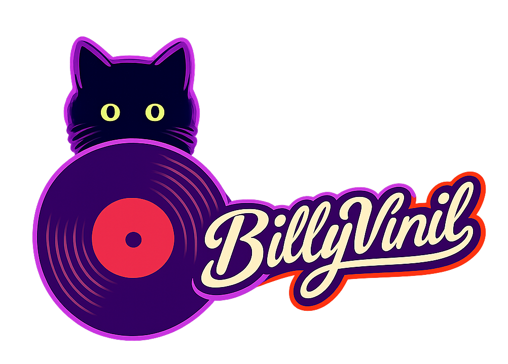

# BillyVinil: Página de e-commerce de Discos de Vinil



Esta é uma página de e-commerce de discos de vinil desenvolvida para um curso de formação continuada em desenvolvimento front-end. Tem como objetivo aplicar os conhecimentos desenvolvidos ao longo do curso em HTML, CSS e JavaScript.

| Aspecto        | Descrição |
|----------------|-----------|
| Conceito       | Site de e-commerce para discos de vinil, com design responsivo e temático, UX/UI claro e segmentado. |
| Público-alvo   | Principalmente colecionadores, mas também pessoas que possam se interessar por discos de vinil (ex.: por estética, para presentes, etc). |
| Diferenciais   | Página dinâmica, com personalidade, com seção de ofertas dedicada e temática. |

## Tema Escolhido
A ideia inicial deste projeto era desenvolver um e-commerce voltado para mídias físicas em geral, incluindo discos de vinil, CDs e fitas cassete. No entanto, ao longo do planejamento, optei por direcionar o foco exclusivamente para os discos de vinil, buscando aprofundar melhor o conceito e a identidade do site.

Escolhi o vinil pois é algo que faz parte da minha própria história. Meu pai coleciona discos, CDs e fitas cassete desde jovem, e, por isso, sempre tivemos uma pequena coleção em casa. A familiaridade com as mídias físicas de música foi o que inspirou o tema do projeto.

O projeto busca reforçar a importância de preservar as mídias clássicas, a cultura material e a forma mais atenta e significativa de consumir música, além de explorar esse nicho de mercado que vem crescendo nos últimos anos.

## Funcionalidades
- **Cards dinâmicos e responsivos**: Exibição dos discos de forma adaptável e responsiva em layout, exibição de preço e descontos.
- **Sistema de busca**: Filtro para encontrar álbuns específicos.
- **Carrossel de destaques**: Responsivo e dinâmico.
- **Carrinho**: Simulação do carrinho de compras com cálculo de estoque e descontos usando o LocalStorage.
- **Página de favoritos**: Salvos no LocalStorage.
- **JSON**: Simulação de um banco de dados para o estoque de discos usando um arquivo JSON externo.
- **Controle de Estoque**: Sistema de controle de estoque com informações dos discos armazenados e funções de cadastro.
- **Upload de Imagens**: Gerenciamento e upload de arquivos de imagem para os novos discos cadastrados.

## Tecnologias Utilizadas
- HTML5
- CSS3
- JavaScript (ES6+)
- [Bulma CSS](https://bulma.io/) (Framework CSS)
- **Node.js**: Ambiente de execução JavaScript no servidor.
- **Express**: Framework web para gerenciamento de rotas e requisições HTTP.
- **Multer**: Middleware para manipulação de `multipart/form-data`, utilizado para o upload de arquivos de imagem das capas.
- Git e GitHub para controle de versão.

---
## Pré-Requisitos e Instalação

## Pré-Requisitos
### Node.js:

Este projeto necessita do servidor Node.js e Express, caso ainda não tenha o ambiente configurado, siga os passos abaixo:

#### Windows e macOS
1. Acesse o site oficial do Node.js: https://nodejs.org
2. Execute o instalador e siga os passos na tela. O gerenciador de pacotes NPM será instalado automaticamente.

#### Linux (Ubuntu/Debian)
Abra o seu terminal e execute os comandos para atualizar o sistema e instalar o Node.js junto com o NPM:
```bash
sudo apt update
sudo apt install nodejs npm
```
### Live Server - Extensão 
* No Visual Studio Code, instale a extensão **Live Server** através do menu de extensões.

## Executando o Projeto

### 1. Clone o repositório
Abra o seu terminal (Git Bash, CMD ou terminal do VS Code) e execute o comando abaixo:

```bash
git clone [https://github.com/danribeyllib/BillyVinil--e-Commerce.git](https://github.com/danribeyllib/BillyVinil--e-Commerce.git)
```
## Front End (Página da Loja de Discos):
### Opção 1: Executando com a extensão Live Server (Apenas Front-end)

Se você deseja visualizar e testar apenas a interface do front-end diretamente pelo editor de código:

#### Executar a página
* Localize e abra o arquivo `inicio.html`no gerenciador de arquivos do projeto.
* Clique com o botão direito sobre o arquivo escolhido e selecione a opção **Open with Live Server**.
* O projeto será aberto automaticamente em seu navegador padrão, utilizando o endereço local configurado, exemplo: `http://127.0.0.1:5500/`.
* Na página, selecione **Página Inicial - Loja**.


### Opção 2: Execução Online (Acesso Direto)

Caso prefira visualizar o comportamento do projeto sem realizar nenhuma configuração ou instalação local na sua máquina:

* **Netlify**: Acesse a aplicação publicada através do link - [https://billyvinil.netlify.app/](https://billyvinil.netlify.app/)

## Sistema de Controle de Estoque:

### Node.js, Express e Multer (Servidor Backend)
* Necessário para ativar o servidor backend completo para gerenciamento de rotas e uploads de arquivos de imagem.

### Passo 1: Instalar as dependências
* Com o terminal aberto na pasta do projeto, instale os pacotes necessários listados no package.json executando:
```bash
npm install
```
### Passo 2: Iniciar o servidor
```bash
npm start
```
### Passo 3: Abrir a Página
* Abra o arquivo `inicio.html` e selecione **Estoque**, em seguida insira o login e senha indicados abaixo dos campos.
